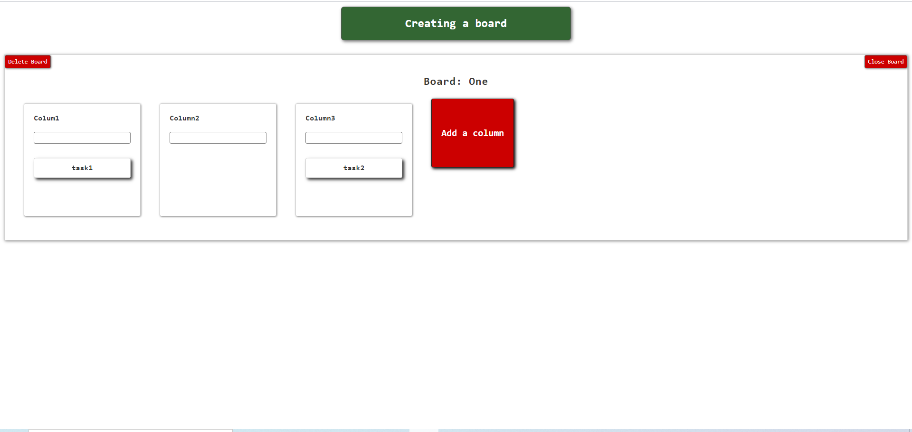

# Канбан-доска для списка #
### Описание
Канбан-доска для управления проектами



### Технологии
- React
- Typescript
- MobX
- LESS

### Установка
- клонирование приложения командой
  ```bsh
  git clone https://github.com/PotapenkoVadim/kanban-app.git
- установка зависимостей
  ```js
  npm install
- запуск локального сервера port:4200
  ```js
  npm run start

### Дополнительно
Подробнее приложение можно посмотреть на этой [странице](https://potapenkovadim.github.io/kanban-app/dist/index.html).
Ввод наименования задачи происходит через клавишу Enter.
Собранный проект находится в директории dist/